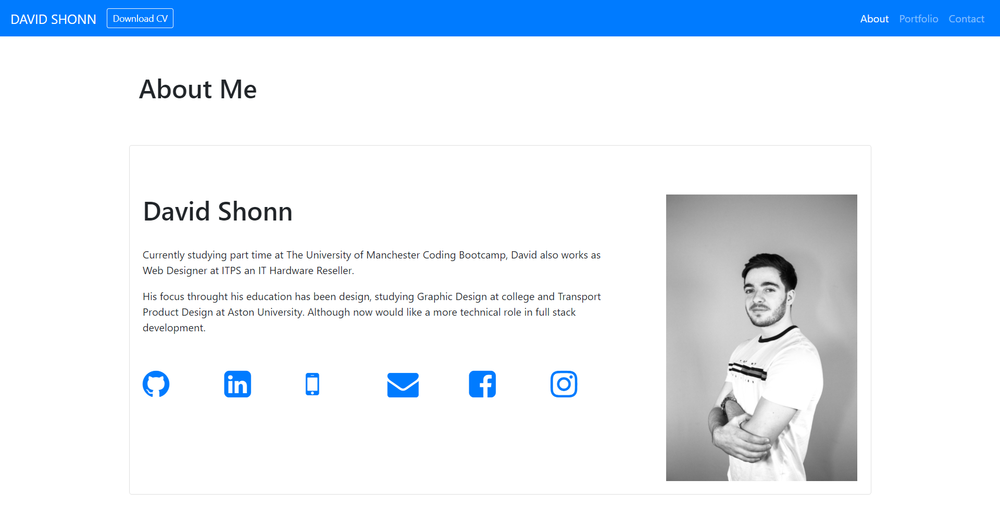
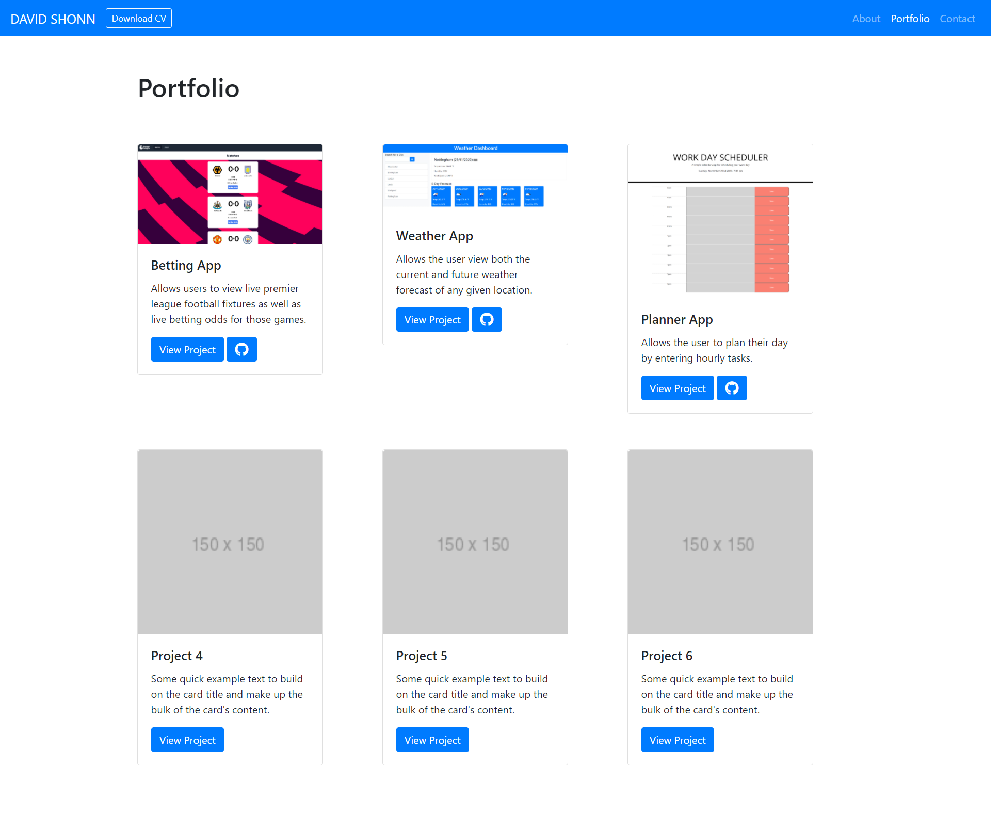
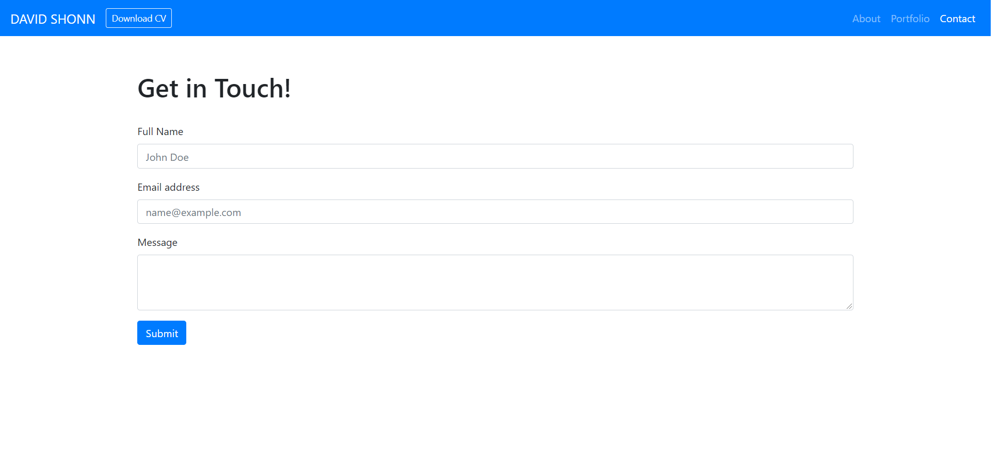

# week-10-updated-portfolio

The motivation of this project is to continually build a portfolio website which will showcase my personal work. Utilising bootstrap, it will be designed in such a way that highlights my key skills and employability.

## Sceen Capture of Live Website

## Link to Live Website

[Link to website](https://davidlshonn.github.io/week-16-portfolio-update/ "My Portfolio") 
